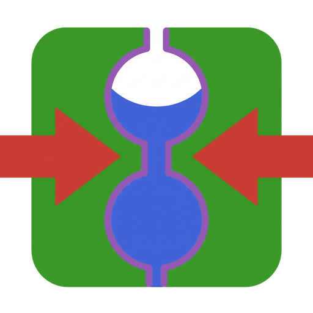

# PoroMechanics.jl

<p align="center">
  
</p>

*Reactive transport and poromechanics of porous media.*

[](https://MicroPoroChemoMechanics.github.io/PoroMechanics.jl/stable/)
[](https://MicroPoroChemoMechanics.github.io/PoroMechanics.jl/dev/)

[](https://github.com/MicroPoroChemoMechanics/PoroMechanics.jl/actions/workflows/CI.yml)
[](https://codecov.io/gh/MicroPoroChemoMechanics/PoroMechanics.jl)

[](https://github.com/MicroPoroChemoMechanics/PoroMechanics.jl/blob/main/LICENSE)
[](https://github.com/fredrikekre/Runic.jl)

## Introduction

PoroMechanics.jl simulates coupled phenomena in porous media — flow, solute and reactive
transport, cement chemistry, and poromechanics — on two numerical backends: finite volumes
for transport, finite elements for coupled mechanics. Despite the name, transport and
reactive chemistry are first-class: the package covers the range from single-species
diffusion to multi-ionic reactive transport in cementitious materials.

A physics model is a plain Julia struct holding its material parameters. Multiple dispatch
on that struct selects the constitutive behavior, so a model file stays a description of
its own equations and knows nothing about time stepping or assembly. Jacobians are never
written by hand: the finite volume callbacks are differentiated automatically with
[ForwardDiff.jl](https://github.com/JuliaDiff/ForwardDiff.jl).

### Key features

- **Unsaturated flow**: Richards' equation with Van Genuchten retention and Mualem relative
  permeability; transient Darcy flow.
- **Solute and multi-ionic transport**: Fick diffusion, Nernst-Planck transport closed by an
  electroneutrality constraint, effective diffusivity from the Oh-Jang tortuosity model.
- **Non-isothermal drying**: liquid water, dry air and heat coupled through a modified
  Kelvin equation and an entropy balance, with latent-heat transport by vapor.
- **Poromechanics**: Biot poroelasticity on unstructured meshes, assembled once and reused
  across time steps.
- **Reactive transport in cementitious materials**: operator splitting (SNIA) with
  thermodynamic equilibrium from cemdata18 through
  [ChemistryLab.jl](https://github.com/MicroPoroChemoMechanics/ChemistryLab.jl), Friedel's
  salt binding, and surface complexation on C-S-H.

| Problem class | Backend |
| :--- | :--- |
| Transport, diffusion, flow | [VoronoiFVM.jl](https://github.com/j-fu/VoronoiFVM.jl) |
| Coupled mechanics | [Ferrite.jl](https://github.com/Ferrite-FEM/Ferrite.jl) |

Not all of that is installable yet, and the distinction is worth stating plainly. Fick
diffusion, transient Darcy flow, Richards' equation, the retention and
relative-permeability laws, the Oh-Jang tortuosity, Biot poroelasticity, Drucker-Prager and
Barcelona Basic plasticity, and the homogenization backend live in `src/` and come with the
package. Nernst-Planck transport, non-isothermal drying and the whole reactive-transport
chain are **worked examples** under `examples/`, with different validation levels listed
below. They are not part of the exported model API.
They move into `src/Models/` as they mature.

That is also why the chemistry stack is not a dependency of this package: nothing in `src/`
calls it. `ChemistryLab.jl` and `OptimaSolver.jl` are dependencies of `examples/` and of the
test suite, where they are actually used.

The examples and tests use ChemistryLab **0.14.2** with OptimaSolver **0.5**. Compatible
patch updates are allowed; a new ChemistryLab minor version needs another compatibility
review. Update an existing examples environment with:

```sh
julia +1.12 --project=examples -e 'using Pkg; Pkg.update(["ChemistryLab", "OptimaSolver"])'
```

Since ChemistryLab 0.14, `equilibrate(state)` uses the certified route by default. This
affects example 2b and may change compositions and runtime. Calls that explicitly pass an
optimizer retain the single-backend behavior, including the transient callbacks in
examples 3 and 4. Updating the dependency alone does not certify those transient results.

### Validation status

| Model or example | Automated checks | Limits |
| :--- | :--- | :--- |
| Fick, Darcy | Model tests and profile regression | Tested cases do not cover every boundary condition |
| Richards | Model tests, 1D regression, Gardner analytical solutions and refinement | The Richards 2D example is outside the regression suite |
| Biot | Profile regression, Terzaghi, Mandel, Cryer and De Leeuw solutions and refinement | Validation is tied to the discretizations and cases tested |
| BBM, Drucker–Prager | Material paths, tangents and parameter sensitivities; BBM reference cases | Live Bil comparisons require an external Bil checkout |
| Homogenization | Cell tests and reference comparisons | 2D plane strain; Float64 assembly and finite-difference macroscopic tangent |
| Non-isothermal drying | Profile regression | Regression alone does not establish physical accuracy |
| Chloride and reactive transport | Chemistry interface, element balance and certified OPC initialization for examples 3 and 4 | No full-profile regression; transient chemistry still uses the legacy solver |

The reactive examples are experimental. Examples 3 and 4 now initialize OPC through
ChemistryLab’s certified solver, checked against the original element totals. The legacy
interior-point solver still fails the OPC mass-action criterion in
`test/chemistry_interface.jl` and remains in the transient chemistry callbacks. Certifying
the initial condition does not validate the full transport history. The previously reported
solid-solution `ChemicalState` construction failures in `tran2018.jl` and
`m100_ternary.jl` were not reproduced in the migration checks under either 0.13.0 or
0.14.2 with the current example code and saved dependency environments. Their full
hydration and transport simulations still need numerical validation.

Parameter differentiation is tested for constitutive laws and selected solves, not for
every backend. In particular, the homogenization backend does not currently preserve
parameter Dual types through its assembly.

### Scope, and where the chemistry belongs

PoroMechanics.jl is today a *chemo*-poro-mechanics code: next to transport and mechanics it
carries chemistry of its own — surface complexation on C-S-H (double layer model), mineral
dissolution and precipitation kinetics, and the physico-chemical data tables the reactive
examples read.

That is a transitional state, not a design choice. Thermodynamic equilibrium is already
delegated to [ChemistryLab.jl](https://github.com/MicroPoroChemoMechanics/ChemistryLab.jl),
which owns the databases, the speciation and the Gibbs minimization. The rest is meant to
follow it upstream, leaving this package to describe transport and mechanics and to call
ChemistryLab.jl for everything chemical.

The clearest sign that the code currently sits in the wrong repository: the double layer
model exists here in three near-identical variants, one per example family. A single
implementation, in ChemistryLab.jl, is where it should live.

## Installation

```julia
using Pkg
Pkg.add("PoroMechanics")
```

The example below also builds its grid with `ExtendableGrids`, which the package does not
depend on — a model is handed a grid, it does not construct one:

```julia
Pkg.add("ExtendableGrids")
```

Julia 1.12 or later. The package's own dependencies do not force that floor any more, but
it is the only version the project is tested on: `examples/` and the test suite pull
`ChemistryLab.jl` and `OptimaSolver.jl`, which require it, and CI runs nothing below it.

For local development:

```julia
Pkg.develop(path = "path/to/PoroMechanics.jl")
```

## Example

Fick diffusion of a solute through a saturated porous medium. The model ships with the
package, so the script is the *case* — a grid, an imposed concentration, a time window:

```julia
using PoroMechanics, VoronoiFVM, ExtendableGrids

m    = FickModel(; phi = 0.30, D = 1.0e-10, dirichlet = ((1, 1.0),))
grid = simplexgrid(range(0, 1.0; length = 101))
sys  = fvm_system(m, grid)

inival = unknowns(sys; inival = 0.0)
inival[1, 1] = 1.0        # keep the initial state consistent with the boundary value
control = VoronoiFVM.SolverControl(; Δt = 1.0e4, Δt_max = 1.0e7, Δu_opt = 0.1)
tsol = solve(sys; inival, times = (0.0, 1.0e8), control)
```

`dirichlet` is data, not a method: the concentration imposed on boundary region 1 is what
distinguishes this case from the next one, and the sealed face needs no code at all — zero
flux is what `VoronoiFVM` does with a boundary nobody claims.

No Jacobian appears anywhere: `VoronoiFVM.solve` differentiates the model's callbacks and
owns the Newton loop and the adaptive time stepping. The `control` is not decoration —
left at its defaults, `Δu_opt` sizes the steps for a problem whose time scale is not 10⁸ s.

A model the package does not ship is a struct plus the three callbacks its physics needs,
and nothing else is registered or declared; the
[quickstart](https://MicroPoroChemoMechanics.github.io/PoroMechanics.jl/dev/quickstart/)
writes one from scratch.

## Documentation

- [**STABLE**](https://MicroPoroChemoMechanics.github.io/PoroMechanics.jl/stable/) &mdash; **most recently tagged version of the documentation.**
- [**DEV**](https://MicroPoroChemoMechanics.github.io/PoroMechanics.jl/dev/) &mdash; **development version of the documentation.**

| Section | For |
| :--- | :--- |
| **Getting Started** | writing and running a first model, end to end |
| **Examples** | one worked problem per physics, with its equations, material data and reference solution |
| **API** | every exported name |
| **References** | the literature the models are built from |

## Running the examples

The examples need more packages than the library itself (plotting, mesh generation,
chemistry), so they live in their own environment:

```julia
using Pkg
Pkg.activate("examples")
Pkg.develop(path = ".")     # once, to point the environment at this checkout
Pkg.instantiate()

include("examples/fickian_diffusion/run.jl"); run_fickian_diffusion()
```

`examples/richards_2d` also needs a tabulated retention curve. A synthetic one is generated
by `examples/richards_2d/make_retention_table.jl`; point the `RICHARDS_2D_DATA` environment
variable at your own measurements to replace it.

Load one example per Julia session: Ferrite and VoronoiFVM both export `update!`, so
importing them together leaves the name ambiguous.

## Tests

```julia
julia --project -e 'using Pkg; Pkg.test()'
```

With Juliaup, use `julia +1.12` to select the supported version without changing the
default used by other projects. Test groups can be run separately:

```sh
julia +1.12 --project -e 'using Pkg; Pkg.test(test_args=["core"])'
julia +1.12 --project -e 'using Pkg; Pkg.test(test_args=["validation", "regression"])'
julia +1.12 --project -e 'using Pkg; Pkg.test(test_args=["chemistry"])'
```

With no arguments, all groups run, including `bil` when its inputs are available. Group
selection reduces execution time; `Pkg.test` still resolves the full test environment.
Regression tolerances are case-specific: `1e-10` except for Richards 1D (`1e-3`, due to
measured adaptive-step drift across platforms). Set `POROMECHANICS_STRICT_REGRESSION=true`
for `1e-10` on every case when comparing within a controlled numerical environment.

CI runs Julia 1.12 (minimum supported) and stable on Ubuntu and Windows.

## Release notes

See [CHANGELOG.md](CHANGELOG.md).

## Citation

If you use PoroMechanics.jl in your research, please cite it:

```bibtex
@software{poromechanics_jl,
  author    = {Soive, Anthony and Barth{\'e}l{\'e}my, Jean-Fran{\c{c}}ois},
  title     = {{PoroMechanics.jl}: Reactive transport and poromechanics of porous media},
  version   = {0.1.0},
  url       = {https://github.com/MicroPoroChemoMechanics/PoroMechanics.jl},
}
```

The [CITATION.cff](CITATION.cff) file is also available for tools such as
[Zenodo](https://zenodo.org/) and [citeas.org](https://citeas.org/). A DOI will be minted
with the first tagged release.

## Authors

Developed by [Anthony Soive](https://github.com/anthonysoive) and
[Jean-François Barthélémy](https://github.com/jfbarthelemy), researchers at
[Cerema](https://www.cerema.fr/en) in the [UMR MCD](https://mcd.univ-gustave-eiffel.fr/)
research team.

## License

MIT — see [LICENSE](LICENSE). © 2026 Anthony Soive and Jean-François Barthélémy.

## Acknowledgements

Parts of this codebase were developed with the assistance of Anthropic's *Claude Code*,
under the authors' review and numerical validation.
