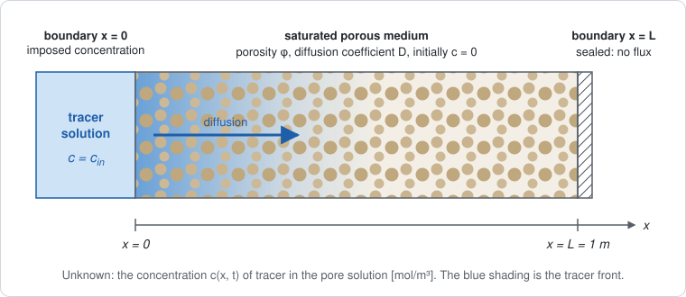

# Getting Started

This page follows one simulation all the way through: from a sketch of the physical problem,
to its equation, to the pieces a finite volume solver needs, to the Julia code that supplies
those pieces, and finally to a plot of the result. The problem is deliberately simple, a
tracer diffusing through a saturated porous medium. The *steps*, however, are the same for
every finite volume model in the package, including the ones with several coupled unknowns.

!!! note "The five steps"
    1. **Describe the problem**: the geometry, the unknown, and the boundary and initial conditions.
    2. **Write the equation as a balance**: accumulation + net outflow = 0.
    3. **See what the solver asks for**: the stored amount at a node, the flux between two
       neighboring nodes, and the boundary conditions.
    4. **Write those pieces as methods** of a model type.
    5. **Build a grid, set the initial state, solve**, and look at the result.

The package already ships this equation as [`FickModel`](@ref), with per-region
coefficients and its boundary data stored in a field. The page writes it again from scratch
because what matters here is the mechanism, not the equation. It is called `TracerModel` so
that the two names do not collide.

## 1. The problem to simulate



A slab of saturated porous medium, one meter long, initially contains no tracer. At
``t = 0`` its left face is put in contact with a solution of concentration ``c_\text{in}``.
The tracer enters the pore solution and diffuses to the right. The right face is sealed, so
no tracer can leave through it.

The slab is uniform across its section, so nothing changes in ``y`` or ``z``. The problem
is therefore **one-dimensional**, with a single unknown: the concentration ``c(x, t)`` of
tracer in the pore solution, in mol per m³ of solution.

| Symbol | Value | Unit | Meaning |
|---|---|---|---|
| ``\varphi`` | ``0.30`` | — | porosity: volume fraction of the medium filled by the pore solution |
| ``D`` | ``10^{-10}`` | m²/s | effective diffusion coefficient of the tracer |
| ``c_\text{in}`` | ``1.0`` | mol/m³ | concentration imposed at ``x = 0`` |
| ``L`` | ``1.0`` | m | length of the slab |
| ``t_\text{end}`` | ``10^{8}`` | s | simulated duration, about three years |

| Where | Condition | Type |
|---|---|---|
| everywhere, at ``t = 0`` | ``c = 0`` | initial condition |
| ``x = 0`` | ``c = c_\text{in}`` | Dirichlet: the *value* is imposed |
| ``x = L`` | no flux through the face | homogeneous Neumann: the *flux* is imposed, equal to zero |

## 2. The equation, read as a balance

Tracer is neither created nor destroyed. In any piece of the medium, the amount stored can
therefore change only by what flows in or out:

```math
\underbrace{\frac{\partial (\varphi\, c)}{\partial t}}_{\text{accumulation}}
\;+\;
\underbrace{\nabla \cdot \mathbf{j}}_{\text{net outflow}}
\;=\; 0,
\qquad
\mathbf{j} = -\,D\,\varphi\,\nabla c
```

The equation has two terms, and each one answers a separate question.

- **The accumulation term** answers *how much tracer is stored here?* ``c`` is counted per
  m³ of pore solution, but only the fraction ``\varphi`` of the medium is solution. So
  ``\varphi c`` is the amount of tracer per m³ of *porous medium* [mol/m³]. Its time
  derivative is the rate at which that stored amount grows or shrinks.
- **The flux** ``\mathbf{j}`` answers *how much tracer crosses a surface?* It is an
  amount per unit area per unit time [mol/(m²·s)]. Fick's law says that tracer moves from
  high to low concentration, which is where the minus sign comes from. The factor
  ``\varphi`` is there because diffusion happens only through the pore solution.
- **The divergence** ``\nabla \cdot \mathbf{j}`` is the net outflow per unit volume. When
  more tracer leaves a small volume than enters it, the stored amount decreases.

Substituting ``\mathbf{j}`` gives the more familiar form
``\varphi\, \partial c/\partial t = \nabla\cdot(D\varphi\nabla c)``. In one dimension:

```math
\frac{\partial (\varphi\, c)}{\partial t} + \frac{\partial j}{\partial x} = 0,
\qquad
j = -\,D\,\varphi\,\frac{\partial c}{\partial x}
```

The boundary conditions can be stated in the same terms: ``c = c_\text{in}`` at ``x = 0``,
and ``j = 0`` at ``x = L``.

Why write the equation as a balance rather than as ``\partial c/\partial t = D\,\partial^2 c/\partial x^2``?
Because the finite volume solver asks for exactly these two quantities, **separately**: the
amount stored, and the flux. It handles the time derivative, the divergence and the rest by
itself.

## 3. What the finite volume method does with it

![The segment [0, L] split into nodes; each node has a control volume bounded by dashed lines; the edge between nodes K and L carries the flux.](assets/quickstart_discretization.svg)

The grid places ``N`` nodes along ``[0, L]``. Each node ``K`` owns a **control volume**
``\omega_K`` (orange), bounded by the midpoints between ``K`` and its neighbors (dashed
lines). Two neighboring nodes ``K`` and ``L`` are joined by an **edge** (blue), and their
control volumes touch at an interface ``\sigma_{KL}``.

The balance of section 2 is then written for each control volume. Integrate it over
``\omega_K`` and replace the time derivative by a difference over one time step ``\Delta t``
(implicit Euler, where ``n`` is the current step):

```math
\underbrace{\lvert\omega_K\rvert\;
\frac{s(c_K^{n}) - s(c_K^{n-1})}{\Delta t}}_{\text{accumulation in } \omega_K}
\;+\;
\underbrace{\sum_{L\ \text{neighbor of}\ K}
\frac{\lvert\sigma_{KL}\rvert}{h_{KL}}\; g\big(c_K^{n}, c_L^{n}\big)}_{\text{what leaves } \omega_K \text{ through its faces}}
\;=\; 0
```

with

```math
s(c) = \varphi\, c,
\qquad
g(c_K, c_L) = D\,\varphi\,(c_K - c_L).
```

``s`` is the stored amount. ``g`` comes from the flux through the interface: along the edge,
``j = -D\varphi\,\partial c/\partial x \approx D\varphi\,(c_K - c_L)/h_{KL}``, and ``g`` is
the numerator of that expression. It is positive when tracer goes from ``K`` to ``L``. In
one dimension, ``\lvert\omega_K\rvert = h`` (``h/2`` at the two end nodes),
``\lvert\sigma_{KL}\rvert = 1`` (the interface is a point, counted per unit cross-section),
and ``h_{KL} = h``.

This splits the work in two:

| Piece of the discrete balance | In this problem | Provided by |
|---|---|---|
| stored amount ``s`` | ``\varphi\, c`` | **you**: `storage!` |
| flux ``g`` between two neighboring nodes | ``D\varphi\,(c_K - c_L)`` | **you**: `flux!` |
| boundary conditions | ``c = c_\text{in}`` at ``x = 0`` | **you**: `bcondition!` |
| number and names of unknowns | one unknown, ``c`` | **you**: `nspecies`, `species_names` |
| geometry ``\lvert\omega_K\rvert``, ``\lvert\sigma_{KL}\rvert``, ``h_{KL}`` | from the grid | VoronoiFVM |
| time derivative, sum over neighbors, Jacobian, Newton iterations, step size | — | VoronoiFVM |

Your functions never see a derivative, a mesh size or a loop. They describe the physics
**locally**, at one node or on one edge. The solver calls them for every node and every edge
and puts the results together.

## 4. Writing the model

### 4.1 The parameters: a struct

```@example quickstart
using PoroMechanics
using VoronoiFVM
using ExtendableGrids

Base.@kwdef struct TracerModel <: AbstractPoroModel
    φ::Float64    = 0.30     # porosity [-]
    D::Float64    = 1e-10    # effective diffusion coefficient [m²/s]
    c_in::Float64 = 1.0      # concentration imposed at x = 0 [mol/m³]
end
nothing # hide
```

`TracerModel` is a **type**. It states that a tracer model *has* a porosity, a diffusion
coefficient and an inlet concentration; it does not fix their values. `Base.@kwdef` provides
default values and a keyword constructor, so `TracerModel()` uses the defaults and
`TracerModel(D = 2e-10)` changes only `D`. `<: AbstractPoroModel` declares the type as a
model of this package, which is what [`fvm_system`](@ref) accepts.

### 4.2 Generic functions, and methods for your model

`storage!`, `flux!`, `bcondition!`, `nspecies` and `species_names` are **generic
functions** that belong to `PoroMechanics`. In Julia, a generic function is a name that can
carry several **methods**, and the method that runs is chosen from the types of the
arguments. This mechanism is called *multiple dispatch*. The package declares these functions
without knowing any particular model. Called on a model that has no method of its own,
`storage!` stops with the error `storage! not implemented for …`.

When you write

```julia
PoroMechanics.storage!(f, u, node, m::TracerModel, data) = …
```

you **add a method** to that function. Julia uses it whenever the fourth argument is a
`TracerModel`. Three consequences follow.

- **The `PoroMechanics.` prefix is required.** Without it, you would define a new, unrelated
  function called `storage!` in your own session, and the solver would never call it.
- **The method is written for every `TracerModel`, not for one set of values.** It reads
  `m.φ` and `m.D` when it runs. The numbers are supplied later, when you create an instance
  such as `m = TracerModel()` and pass it to `fvm_system` (section 5). The same method works
  unchanged for `TracerModel(D = 1e-9)`.
- **You never call these methods yourself.** The solver calls them, for every node, every
  edge, every Newton iteration and every time step.

### 4.3 The anatomy of a callback

The three physics callbacks share the same argument list:

```julia
storage!(f, u, node, m, data)       # at one node
flux!(f, u, edge, m, data)          # on one edge
bcondition!(f, u, bnode, m, data)   # at one boundary node
```

| Argument | What it is | Who fills it |
|---|---|---|
| `f` | the result: one entry per unknown, which **you write into** | you |
| `u` | the values of the unknowns where the callback is evaluated | the solver |
| `node`, `edge`, `bnode` | where the callback is evaluated: region number, coordinates, current time | the solver |
| `m` | your model, with its parameter values | `fvm_system` |
| `data` | a slot for user data in VoronoiFVM, unused here | the solver |

The `!` at the end of the name is the Julia convention for a function that modifies one of
its arguments, here `f`. The value the function returns is ignored.

### 4.4 What `u[1]` and `u[1, 1]` mean

The shape of `u` depends on where the callback is evaluated.

- **`storage!` and `bcondition!` look at a single node.** There, `u` is a vector and
  `u[i]` is unknown number `i` at that node. With a single unknown, `u[1]` is the
  concentration ``c`` at that node.
- **`flux!` looks at an edge, which has two nodes.** There, `u` is a matrix and `u[i, j]`
  is unknown number `i` at node `j` **of the edge**, with `j = 1` or `2`. So `u[1, 1]` is
  ``c_K`` and `u[1, 2]` is ``c_L`` (the blue labels in the figure above).

| Expression | Callback | Meaning |
|---|---|---|
| `u[1]` | `storage!`, `bcondition!` | unknown 1 (``c``) at this node |
| `u[1, 1]` | `flux!` | unknown 1 (``c``) at the first node of the edge, ``c_K`` |
| `u[1, 2]` | `flux!` | unknown 1 (``c``) at the second node of the edge, ``c_L`` |
| `u[2, 1]` | `flux!`, model with two unknowns | unknown 2 at the first node of the edge |

The first index counts unknowns, not nodes. In a model with two unknowns, for instance a
liquid pressure and a temperature, `u[2, 1]` would be the temperature at the first node of
the edge, and `flux!` would fill both `f[1]` and `f[2]`, one flux per unknown.

"Node 1" and "node 2" here are **local** to the edge: its first end and its second end.
They are not the nodes numbered 1 and 2 in the grid. The grid numbering only appears later,
in the initial values (section 5.4).

### 4.5 `storage!`: the accumulation term

```@example quickstart
function PoroMechanics.storage!(f, u, node, m::TracerModel, data)
    c = u[1]              # concentration at this node
    f[1] = m.φ * c        # stored amount s(c) = φ c
    return nothing
end
nothing # hide
```

This is ``s(c) = \varphi c``, the quantity **inside** ``\partial/\partial t``, and not its
derivative. The solver computes ``(s^n - s^{n-1})/\Delta t`` and multiplies it by
``\lvert\omega_K\rvert``.

### 4.6 `flux!`: the flux between two nodes

```@example quickstart
function PoroMechanics.flux!(f, u, edge, m::TracerModel, data)
    c_K = u[1, 1]                     # concentration at the first node of the edge
    c_L = u[1, 2]                     # concentration at the second node of the edge
    f[1] = m.D * m.φ * (c_K - c_L)    # g(c_K, c_L), the flux from K to L times h_KL
    return nothing
end
nothing # hide
```

This is ``g(c_K, c_L) = D\varphi\,(c_K - c_L)``. The function returns a **difference** of
node values, not a gradient, because the solver divides by the edge length ``h_{KL}``
itself.

The sign follows a convention: `f[1]` is the flux *from the first node to the second*. When
``c_K > c_L`` it is positive, and tracer moves from ``K`` to ``L``, down the concentration
gradient. That makes the sign easy to check. Writing `c_L - c_K` instead would make
tracer flow toward high concentration, and the computation would blow up.

### 4.7 `bcondition!`: the boundary conditions

```@example quickstart
function PoroMechanics.bcondition!(f, u, bnode, m::TracerModel, data)
    boundary_dirichlet!(f, u, bnode; species = 1, region = 1, value = m.c_in)
    return nothing
end
nothing # hide
```

A grid numbers its boundaries by **region**. For a one-dimensional grid built with
`simplexgrid`, region 1 is the left end (``x = 0``) and region 2 is the right end
(``x = L``).

`bcondition!` is called at **every** boundary node, in both regions. `boundary_dirichlet!`,
a helper from VoronoiFVM, only acts when `bnode.region` equals the requested `region`. At
``x = 0`` it adds a very large penalty term, proportional to ``c - c_\text{in}``, to the
equation of that node, which forces ``c = c_\text{in}``. At ``x = L`` it does nothing.

Doing nothing on a boundary means that **no flux crosses it**. The control volume of the
last node has no neighbor on its right, so nothing is added to its balance through that
side. The sealed face is the default and needs no code.

The shipped [`FickModel`](@ref) goes one step further: it stores the region and the value in
a `dirichlet` field instead of writing `region = 1` into the method, so that the same model
can serve a slab fed from its other end.

### 4.8 `nspecies` and `species_names`: the unknowns

```@example quickstart
PoroMechanics.nspecies(::TracerModel) = 1
PoroMechanics.species_names(::TracerModel) = [:c]
nothing # hide
```

These two functions state how many unknowns the model has at each node, and what they are
called. The argument is written `::TracerModel`, with no variable name, because the answer
depends only on the **type** and not on the parameter values: every `TracerModel` has one
unknown, whatever its porosity.

[`fvm_system`](@ref) reads `nspecies` to declare the unknowns to the solver. That number is
also the length of `f` and the first dimension of `u` in the callbacks. The names are there
for humans, in plots and output.

## 5. Solving

### 5.1 An instance: the parameter values enter here

```@example quickstart
m = TracerModel()
```

Up to this point, only types and methods have been defined. `m` is the first object that
carries actual numbers.

### 5.2 The grid

```@example quickstart
grid = simplexgrid(range(0, 1.0; length = 101))
```

This grid has 101 nodes and 100 cells, so ``h = 0.01`` m.

### 5.3 The system: where the model meets the solver

```@example quickstart
sys = fvm_system(m, grid)
nothing # hide
```

VoronoiFVM expects callbacks with four arguments, `(f, u, node, data)`, and knows nothing
about `m`. [`fvm_system`](@ref) builds those callbacks, and each one **captures** `m`:

```julia
storage = (f, u, node, data) -> PoroMechanics.storage!(f, u, node, m, data)
```

This is how the parameters reach the methods written in section 4. The anonymous function
remembers `m`. Each time VoronoiFVM calls it, it passes `m` on to your method, which then
reads `m.φ`.

### 5.4 The initial state

```@example quickstart
inival = unknowns(sys; inival = 0.0)
inival[1, 1] = m.c_in
size(inival)
```

`inival` is a matrix of size (number of unknowns) × (number of grid nodes), and `inival[i, k]`
is unknown `i` at **grid** node `k`. Here, `inival[1, 1]` is ``c`` at the first grid node,
at ``x = 0``.

!!! warning "Same notation, different meaning"
    In `flux!`, the second index of `u[1, 1]` means *the first node of the edge*. In
    `inival[1, 1]`, it means *node number 1 of the grid*.

Setting that one value matters. If it were left at zero, the Dirichlet node would jump from
`0` to `c_in` during the first step. The step-size controller would see a change that
shrinking `Δt` cannot reduce, and it would halve the step down to `Δt_min` before giving up.

### 5.5 Time stepping

```@example quickstart
control = VoronoiFVM.SolverControl(; Δt = 1.0e4, Δt_max = 1.0e7, Δu_opt = 0.1)
tsol = solve(sys; inival, times = (0.0, 1.0e8), control)
nothing # hide
```

`times = (0.0, 1.0e8)` gives only the start and end times. The solver chooses the steps in
between and stores the solution after each one.

- `Δt` is the first step, and `Δt_max` is the largest step allowed.
- `Δu_opt` is the change in concentration per step that the controller aims for, in the
  units of the unknown. If it is left at its default, a problem whose time scale is 10⁸ s is
  integrated with steps sized for a different problem.

### 5.6 Reading the solution

```@example quickstart
(length(tsol.t), maximum(tsol[1, :, end]))
```

`tsol[i, k, n]` is unknown `i` at grid node `k` after step `n`. `tsol.t` lists the times of
the stored steps. `tsol(t)` interpolates the solution at any time `t` within the simulated
interval.

## 6. Looking at the result

On a semi-infinite medium, this problem has an exact solution:

```math
c(x, t) = c_\text{in}\,\operatorname{erfc}\!\left(\frac{x}{2\sqrt{D t}}\right)
```

It applies here as long as the front, of width about ``2\sqrt{Dt}``, stays far from the
sealed face. At ``t_\text{end}`` that width is 0.2 m, compared with ``L = 1`` m.

```@example quickstart
using Plots
using SpecialFunctions: erfc

x = grid[Coordinates][1, :]
p = plot(; xlabel = "x [m]", ylabel = "c [mol/m³]", xlims = (0, 0.5), legend = :topright)
for t in (1.0e6, 1.0e7, 1.0e8)
    plot!(p, x, tsol(t)[1, :]; lw = 2, label = "computed, t = $t s")
    plot!(p, x, m.c_in .* erfc.(x ./ (2 * sqrt(m.D * t)));
        ls = :dash, color = :black, label = t == 1.0e8 ? "erfc solution" : "")
end
p
```

The porosity does not appear in the exact solution. On a homogeneous medium, ``\varphi``
multiplies both the accumulation and the flux, so it cancels. It no longer cancels across an
interface between two materials of different porosity, which is why the model keeps it in
both terms.

## 7. Where the Jacobian went

There is no Jacobian to write. `VoronoiFVM.solve` differentiates `storage!` and `flux!`
with respect to `u` using `ForwardDiff.jl`, then runs its own Newton loop and adaptive time
stepping. For that to work, `u` must be allowed to carry dual numbers instead of `Float64`.
Do not annotate `u` as `Float64`. When a callback short-circuits, return `zero(x)` rather
than a bare `0.0`.

The models shipped with the package go one step further. Their parameter fields are
type-parameterized instead of declared `Float64`, which lets a result be differentiated with
respect to ``D`` or ``\varphi`` as well as ``u``. See
[Parameter identification](demos/parameter_identification.md).

## Summary

| In the equation | In the discrete balance | Callback | Code |
|---|---|---|---|
| accumulation ``\varphi c`` | ``s(c_K)`` | `storage!` | `f[1] = m.φ * u[1]` |
| flux ``j = -D\varphi\,\partial c/\partial x`` | ``g(c_K, c_L)`` | `flux!` | `f[1] = m.D * m.φ * (u[1, 1] - u[1, 2])` |
| ``c = c_\text{in}`` at ``x = 0`` | penalty at the boundary node | `bcondition!` | `boundary_dirichlet!(…; region = 1, value = m.c_in)` |
| ``j = 0`` at ``x = L`` | nothing added | — | — |
| one unknown ``c`` | size of `f` and of `u` | `nspecies`, `species_names` | `1`, `[:c]` |

## Next

The [examples](examples/fickian_diffusion.md) cover one worked problem per physics. Each
gives its governing equations, its material data, and the reference solution it is checked
against. They use the models the package ships instead of defining their own, which is the
split this page explains. [Writing a model](demos/writing_a_model.md) measures what that
choice costs and what it buys.
