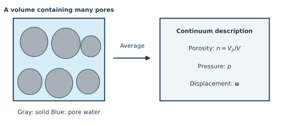

# 1. Porous media and notation

## From grains and pores to a continuum

Think of a small piece of saturated sandstone. It contains a connected solid structure,
the **skeleton**, and water in the connected pore space. The solid material making up
the grains and the skeleton are different objects: the skeleton can deform through
changes in pore shape even when individual grains barely change volume.

Resolving every pore would be expensive. Instead, we average over a volume containing
many pores but small compared with the specimen. This is a **representative elementary
volume**: large enough to give meaningful averages, small enough to describe spatial
variations. This separation of scales is an assumption, and can fail near a large crack
or when a specimen contains only a few pores.

```@raw html

```

*Figure 1. The blue region represents pore water and the gray regions represent solid
material. The drawing is conceptual; it is not a numerical mesh or a measured microstructure.*

## Two definitions of porosity

Let $V_0$ be the initial total volume, $V$ the current total volume, and $V_p$
the current pore volume. Define

```math
n = \frac{V_p}{V}, \qquad \phi = \frac{V_p}{V_0}, \qquad
J = \frac{V}{V_0}, \qquad \phi = Jn.
```

The **Eulerian porosity** $n$ uses the current volume. The **Lagrangian porosity**
$\phi$ uses the reference volume. At the reference state $J=1$, so both equal
$\phi_0$. For a rigid medium they remain equal. The transport-only models use a fixed
porosity $\phi$; this parameter does not describe an evolving pore volume.

For example, start with $V_0=100\ \mathrm{cm^3}$ and $V_{p0}=30\ \mathrm{cm^3}$.
If incompressible grains rearrange so that $V=98\ \mathrm{cm^3}$, the solid still
occupies $70\ \mathrm{cm^3}$, and $V_p=28\ \mathrm{cm^3}$. Then
$n=28/98\simeq0.286$, whereas $\phi=28/100=0.280$. Both are correct, but they
answer different questions.

## Displacement and small strain

The displacement vector $\mathbf u$ tells us how far a material point moves.
In a straight bar, the axial strain is $\varepsilon_{xx}=\partial u_x/\partial x$:
a uniform translation produces no strain, while a displacement that increases along
the bar stretches it.

In several dimensions the small-strain tensor is

```math
\boldsymbol\varepsilon = \tfrac12\left(\nabla\mathbf u+
(\nabla\mathbf u)^{\mathsf T}\right), \qquad
\varepsilon_v=\operatorname{tr}\boldsymbol\varepsilon=\nabla\cdot\mathbf u.
```

Here $\nabla\mathbf u$ collects displacement derivatives, the superscript
$\mathsf T$ transposes a matrix, and the trace adds its diagonal entries.
The diagonal strains describe extension; off-diagonal entries describe shear.
The volumetric strain $\varepsilon_v$ approximates $(V-V_0)/V_0$. Therefore,
to first order, $J\simeq1+\varepsilon_v$ and
$\delta\phi\simeq\delta n+\phi_0\varepsilon_v$.
Small displacement gradients, including small rotations, are assumed here.

## Stress and pressure have different signs

The stress tensor $\boldsymbol\sigma$ describes the force per unit area transmitted
across an internal surface. For a surface with outward unit normal $\mathbf n$,
the traction vector is $\mathbf t=\boldsymbol\sigma\mathbf n$.

We take **tension and extension as positive**. Compression therefore gives negative
normal stress and negative volumetric strain. Fluid pressure $p$ is positive in
compression: a fluid alone has stress $-p\mathbf I$, where $\mathbf I$ is the
identity tensor. Thus a compressive load of magnitude $P>0$ gives
$\sigma_{zz}=-P$. This convention agrees with the total-stress relation in the code.

In the saturated linear theory below, $p$ and $\boldsymbol\sigma$ denote changes
from an equilibrated reference state. A zero excess pressure is not a vacuum. For gas
laws and vapor equilibrium, absolute pressures and their reference values must instead
be tracked explicitly.

## Symbols used throughout these pages

| Symbol | Meaning | SI unit |
|:---|:---|:---|
| $\mathbf u$, $\boldsymbol\varepsilon$ | Displacement, strain | m, dimensionless |
| $\boldsymbol\sigma$, $p$ | Total stress, pore pressure | Pa |
| $n$, $\phi$, $S_l$ | Current porosity, reference porosity, liquid saturation | dimensionless |
| $\rho_l$, $\mu_l$ | Liquid density, dynamic viscosity | kg/m³, Pa·s |
| $\mathbf q$, $\mathbf w=\rho_l\mathbf q$ | Relative volume flux, relative mass flux | m/s, kg/(m²·s) |
| $k$, $\mathcal K=k/\mu_l$ | Intrinsic permeability, pressure mobility | m², m²/(Pa·s) |
| $b$, $M$ | Biot coefficient, Biot modulus | dimensionless, Pa |
| $\zeta$ | Fluid-content change per reference volume, normalized by reference density | dimensionless |

**Check your understanding.** If a saturated specimen is sealed, must its pore volume
stay constant? No: fluid and solid can compress, so conserving fluid mass does not mean
conserving pore volume. The next chapter makes this distinction explicit.

*Source: Dangla, chapters 1–3 [dangla_notes](@cite). Continue with [balance laws](balances.md).*
