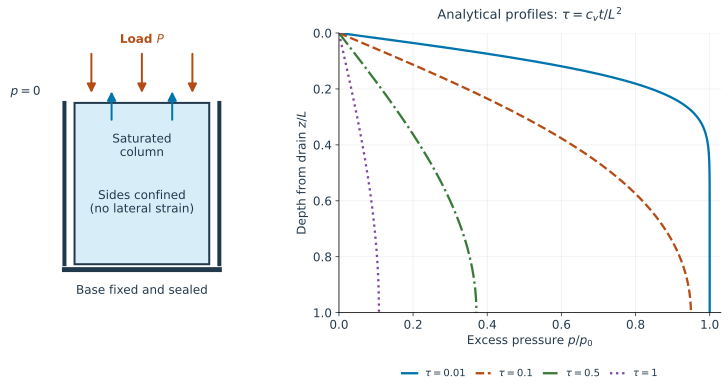

# 5. Consolidation: why settlement takes time

## Load first, drain afterward

Place a load on a saturated column confined by rigid side walls. Initially, little water
has time to leave, and pore pressure rises. Water then drains through an open boundary.
As pressure falls, the skeleton carries more effective compression and settlement grows.
This delayed deformation is **consolidation**.

```@raw html

```

*Figure 3. Left: the Terzaghi column. Right: its analytical pressure profiles, with depth
measured downward from the drain. The plotted times are dimensionless, not seconds.*

## Deriving the pressure equation

Assume a homogeneous column, no body force, no internal source, and no lateral strain.
Write $\varepsilon=\varepsilon_{zz}$, so $\varepsilon_v=\varepsilon$. The axial law is

```math
\sigma_{zz}=H_o\varepsilon-bp, \qquad
H_o=\lambda+2G=K_d+\frac{4G}{3}.
```

Here $H_o$ is the constrained, or oedometric, modulus. The API calls it
[`oedometric_modulus`](@ref); we use $H_o$ here to avoid confusing it with the Biot
modulus $M$. Equilibrium makes $\sigma_{zz}$ spatially uniform. After the applied
load reaches a constant value, $\partial_t\sigma_{zz}=0$, so

```math
\dot\varepsilon=\frac b{H_o}\dot p, \qquad
\dot\zeta=b\dot\varepsilon+\frac1M\dot p
=\left(\frac1M+\frac{b^2}{H_o}\right)\dot p.
```

Insert this into the fluid balance and use Darcy's law:

```math
S_o\frac{\partial p}{\partial t}=\mathcal K\frac{\partial^2p}{\partial z^2},
\qquad S_o=\frac1M+\frac{b^2}{H_o}, \qquad c_v=\frac{\mathcal K}{S_o}.
```

The pressure obeys a diffusion equation with consolidation coefficient $c_v$ in m²/s.
[`storage_coefficient`](@ref) returns this **uniaxial constrained storage** $S_o$.
Under constant isotropic mean stress instead, the corresponding coefficient would be
$1/M+b^2/K_d$. Mechanical constraints matter when choosing storage.
If the applied load varies in time, the eliminated equation also contains
$(b/H_o)\dot\sigma_{zz}$; the source-free diffusion equation above applies after
the load becomes constant.

## Initial and boundary conditions

Let $z$ denote depth below the drained top and $L$ the column height. A drained top
connected to the reference reservoir gives $p(0,t)=0$. An impermeable bottom gives
$\partial_zp(L,t)=0$ in this gravity-free problem. The bottom displacement is fixed,
and the top carries traction $\sigma_{zz}=-P$ with $P>0$.

For an ideal instantaneous load, the undrained interior starts with

```math
p_0=\frac{bP}{H_o/M+b^2}.
```

To derive this, insert $\varepsilon=(-P+bp)/H_o$ into $\zeta=b\varepsilon+p/M=0$.
At the drained surface, pressure is already zero for $t>0$. The ideal initial interior
value and the boundary value therefore meet in a startup discontinuity; they cannot both
hold at that corner. A finite loading ramp or fine early time steps resolves the
corresponding transient numerically.

At long times, $p$ tends to zero and the downward settlement magnitude tends to
$PL/H_o$. Immediately after loading, there is generally already some elastic settlement;
undrained does not mean undeformed.

## Length controls the timescale

The characteristic drainage time is

```math
t_c=\frac{L_d^2}{c_v}, \qquad \tau=\frac{c_vt}{L_d^2},
```

where $L_d$ is the longest drainage path. For one drained face, $L_d=L$; for two
opposite drained faces of the same column, $L_d=L/2$. Thus double drainage reduces
this characteristic time by a factor of four. It is a timescale, not an exact time
at which drainage is complete.

For the single-drain case, define $Z=z/L$ and $\tau=c_vt/L^2$. The solution used
in Figure 3 is

```math
\frac{p}{p_0}=\sum_{j=0}^{\infty}\frac{2}{a_j}\sin(a_jZ)
\exp(-a_j^2\tau), \qquad a_j=(j+\tfrac12)\pi.
```

Each sine satisfies zero pressure at the top and zero gradient at the bottom.
Its exponential factor decays with time. Higher spatial frequencies decay faster,
which is why initially sharp pressure variations become smooth.

## What the benchmarks teach

The [Terzaghi benchmark](../validation/terzaghi.md) compares this series to the finite
element calculation [terzaghi1943](@cite). [Mandel's problem](../validation/mandel.md)
shows that pressure can temporarily rise at some locations even after a fixed load is
applied: mechanical redistribution changes the local storage response. Do not generalize
the monotonic Terzaghi profiles to every geometry.
[Cryer's sphere](../validation/cryer.md) and [De Leeuw's cylinder](../validation/deleeuw.md)
extend the checks to radial geometries.

These cases verify particular equations and discretizations. Agreement with them does
not establish that a chosen material law describes every experimental specimen.
Dangla chapter 6 develops the initial–boundary value viewpoint [dangla_notes](@cite).

**Check your understanding.** Doubling specimen height while keeping single drainage
and the same material multiplies the characteristic consolidation time by four.

Continue with [unsaturated media](unsaturated.md), or go to the
[numerical formulation](numerics.md).
