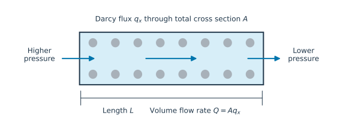

# 3. Transport: Darcy and Fick

## Pressure differences drive water flow

Connect the ends of a saturated horizontal column to reservoirs at different pressures.
Water flows toward the lower pressure. At sufficiently slow flow, Darcy's law relates
the volume flux to the pressure gradient:

```math
\mathbf q=-\frac{k}{\mu_l}(\nabla p-\rho_l\mathbf g)
=-\mathcal K(\nabla p-\rho_l\mathbf g).
```

The intrinsic permeability $k$ describes the pore network; dynamic viscosity $\mu_l$
describes the fluid's resistance to flow. Their ratio $\mathcal K$ is a mobility.
For a horizontal homogeneous column of length $L$ without gravity along its axis,
$q_x=(k/\mu_l)(p_{\mathrm{in}}-p_{\mathrm{out}})/L$. The volume rate through cross
section $A$ is $Q=Aq_x$.

```@raw html

```

*Figure 2. A pressure drop drives flow. The cross section is the whole specimen area,
including solid and pores.*

The Darcy flux is therefore not the mean speed in the pores. In a saturated medium,
the mean liquid velocity relative to the skeleton is $\mathbf q/n$. A flux of
$10^{-6}\ \mathrm{m/s}$ through a medium of porosity 0.25 corresponds to a mean
relative pore velocity of $4\times10^{-6}\ \mathrm{m/s}$.

Gravity matters in a vertical column. With upward coordinate $z$ and
$\mathbf g=-g\mathbf e_z$, hydrostatic equilibrium has $\partial p/\partial z=-\rho_l g$.
Substitution gives zero flux. A pressure gradient alone does not necessarily imply flow.

## Permeability is not hydraulic conductivity

| Quantity | Definition | Unit | Code connection |
|:---|:---|:---|:---|
| Intrinsic permeability | $k$ | m² | `k_int` in `DarcyModel`, `k` in `BiotPoroelastic` |
| Pressure mobility | $\mathcal K=k/\mu_l$ | m²/(Pa·s) | `mobility` for Darcy; `hydraulic_conductivity` for Biot |
| Head-based hydraulic conductivity | $K_h=\rho_l g k/\mu_l$ | m/s | Convert explicitly if data are given in these units. |

The name [`hydraulic_conductivity`](@ref) in the Biot API denotes **pressure mobility**,
not $K_h$. Checking units prevents inserting a coefficient that differs by $\rho_l g$.

## Storage makes flow transient

Suppose a pressure increase stores a normalized fluid volume $S\,\mathrm dp$ per
bulk volume, where $S$ has units Pa⁻¹. With no source and no gravity, mass balance gives

```math
S\frac{\partial p}{\partial t}
-\nabla\cdot(\mathcal K\nabla p)=0.
```

For constant coefficients, this becomes $\partial_t p=D_h\nabla^2p$, with hydraulic
diffusivity $D_h=\mathcal K/S$ in m²/s. Larger mobility speeds up equilibration;
larger storage slows it down.

[`DarcyModel`](@ref) implements this pressure equation. It takes `storativity` directly,
omits gravity, and does not solve displacement. The meaning of $S$ must match the
mechanical conditions of the experiment used to obtain it. Chapter 5 derives the
appropriate coefficient for a laterally confined column. Boundaries absent from
`dirichlet` are impermeable in this model.

**Worked estimate.** For $k=10^{-14}\ \mathrm{m^2}$, $\mu_l=10^{-3}\ \mathrm{Pa\,s}$,
$L=0.1\ \mathrm m$ and a pressure drop of $10^4\ \mathrm{Pa}$, the flux is
$10^{-6}\ \mathrm{m/s}$. Across $A=10^{-3}\ \mathrm{m^2}$, this is
$Q=10^{-9}\ \mathrm{m^3/s}$, or $0.0864$ liters per day.

## Concentration differences drive diffusion

Even without bulk water flow, a dissolved substance spreads from high to low
concentration. Let $c$ be moles per unit **pore-water volume**, in mol/m³.
For the convention used by [`FickModel`](@ref), the molar flux is

```math
\mathbf j=-nD\nabla c, \qquad
\frac{\partial(nc)}{\partial t}+\nabla\cdot\mathbf j=0.
```

Here $\mathbf j$ is measured per total specimen area and has units mol/(m²·s).
The code parameter `D` has units m²/s and is multiplied by `phi` in the flux.
If a source instead tabulates a bulk coefficient $D_{\mathrm{bulk}}$ defined by
$\mathbf j=-D_{\mathrm{bulk}}\nabla c$, then $D_{\mathrm{bulk}}=nD$ for this
model. Do not multiply by porosity a second time when translating such data.

For constant $n$ and $D$, porosity cancels from the equation, yielding
$\partial_t c=D\nabla^2c$. Across materials of different porosity, keep storage
and flux in their conservative forms. `FickModel` describes diffusion only;
advection, electrical migration, and reactions require additional terms or models.

Darcy's law assumes a regime where flux is proportional to the driving gradient;
these pages do not include inertial flow corrections. For the thermodynamic
interpretation, see Dangla §4.8 and §7.10 [dangla_notes](@cite).

Try the [Darcy column](../examples/darcy_column.md) and
[Fickian diffusion](../examples/fickian_diffusion.md), then continue with
[saturated poroelasticity](poroelasticity.md).
