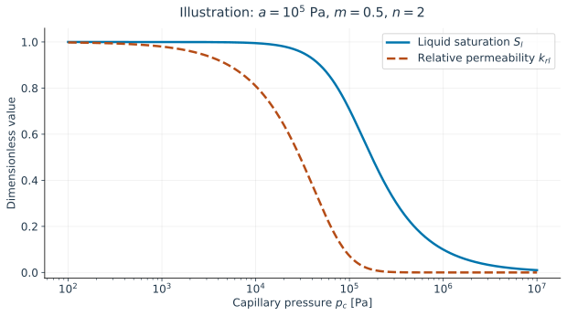

# 6. Unsaturated media and capillary coupling

## Sharing the pores

A saturated material contains liquid throughout the pore space considered by the model.
When gas occupies part of that space, define liquid saturation
$S_l=V_l/V_p$ and gas saturation $S_g=1-S_l$. These are fractions of **pore volume**,
not fractions of total specimen volume. In a rigid medium, the liquid volume fraction
is $nS_l$.

Curved liquid–gas interfaces sustain a pressure difference. We define capillary pressure
as $p_c=p_g-p_l$, where $p_g$ and $p_l$ are gas and liquid pressures. A positive
$p_c$ means that the liquid pressure is lower than the gas pressure. A retention law
relates $S_l$ to $p_c$. Increasing suction usually drains progressively smaller
pores, decreasing saturation.

## Retention and permeability are distinct laws

The implemented [`VanGenuchten`](@ref) curve is

```math
S_l=\left[1+(p_c/a)^n\right]^{-m}\quad(p_c>0), \qquad S_l=1\quad(p_c\le0).
```

Here the exponent $n$ belongs to this curve and is unrelated to the porosity symbol
used in earlier chapters. The pressure scale $a$ is in Pa; both exponents are
dimensionless. This form has no residual-saturation offset. The two-argument constructor
`VanGenuchten(a, m)` uses $n=1/(1-m)$; the three-argument constructor sets the exponents
independently [vangenuchten1980](@cite).

Water also loses connected flow paths during drainage. Relative permeability $k_{rl}$
reduces the saturated permeability to $kk_{rl}$. The [`Mualem`](@ref) implementation uses

```math
k_{rl}=\sqrt{S_e}\left[1-(1-S_e^{1/m})^m\right]^2,
\qquad S_e=\left[1+(p_c/a)^{1/(1-m)}\right]^{-m}.
```

Here $S_e$ is the saturation-like quantity internal to that permeability law. It equals
the retention saturation only when compatible parameter choices are made. The code
allows separate parameters for retention and permeability [mualem1976](@cite).

```@raw html

```

*Figure 4. Illustrative curves for the same $a=10^5$ Pa and $m=0.5$ in both laws
($n=2$). The horizontal axis is logarithmic. These are explanatory parameters,
not fitted data for a particular material.*

A medium can retain substantial water while transmitting very little liquid.
Retention controls the amount stored; permeability controls the rate transported.
Neither curve by itself describes a full flow problem.

## Richards' approximation

If gas pressure stays constant, temperature is fixed, and the skeleton is rigid,
one can solve only for liquid pressure. With constant liquid density,

```math
\frac{\partial}{\partial t}(\rho_l nS_l)
+\nabla\cdot\mathbf w_l=0, \qquad
\mathbf w_l=-\rho_l\frac{k k_{rl}}{\mu_l}
(\nabla p_l-\rho_l\mathbf g).
```

This is the formulation in [`RichardsModel`](@ref). At fixed $p_g$,
$\mathrm dS_l/\mathrm dp_l=-\mathrm dS_l/\mathrm dp_c\ge0$: raising liquid
pressure stores more water. This derivative is the pressure-dependent storage capacity.

The model includes gravity, but it does not solve gas pressure, heat, or deformation.
Unlike `DarcyModel`, it has no additional independent saturated compressibility storage.
If the chosen retention law has a perfectly flat saturated branch, that branch's storage
derivative vanishes. A smooth retention extension such as [`ExponentialCutoff`](@ref)
changes this behavior; it must be treated as a modeling choice, not assumed equivalent
to an arbitrary saturated storativity.

Try the [Richards example](../examples/richards_1d.md) and its
[Gardner validation](../validation/gardner_infiltration.md).

## Which pressure acts on the skeleton?

With two fluid pressures, a single pore pressure is no longer obvious. One model
replaces it by a Bishop-type equivalent pressure,

```math
\pi=p_g-\chi(p_c)p_c, \qquad
\boldsymbol\sigma=\boldsymbol\sigma'-b\pi\mathbf I.
```

Choosing $\chi=S_l$ gives $\pi=S_lp_l+(1-S_l)p_g$. The constitutive API provides
[`SaturationBishop`](@ref) for this choice and [`PowerBishop`](@ref) for
$\chi=S_l^r$, with fitted exponent $r$. These functions are available separately
from the rigid Richards flow model; using Richards alone does not compute deformation.

Dangla §7.15 develops an equivalent pressure that also accounts for interfacial energy.
Under his energy-separation assumptions it contains a contribution from the derivative
of that energy with respect to porosity. The saturation-weighted pressure above omits
that contribution; it is not the full energetic expression [dangla_notes](@cite).
Furthermore, a single-valued retention curve does not describe wetting–drying hysteresis:
that requires information about the loading history.

**Check your understanding.** A porosity of 0.30 and liquid saturation of 0.40 mean that
liquid occupies 0.12 of the total volume, not 0.40.

Continue with [drying and temperature](drying.md).
