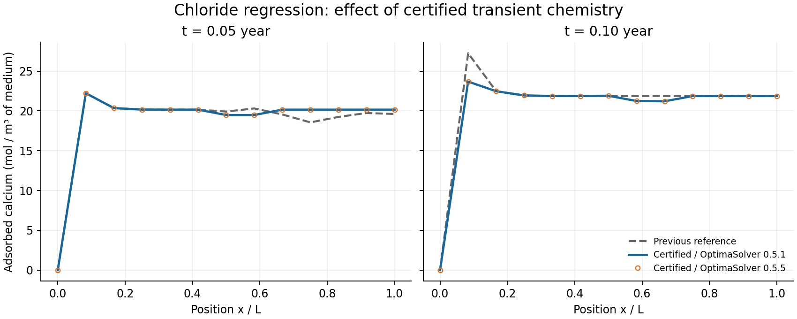

# Regression references

References record numerical behavior; they do not establish physical accuracy.
Regenerate a reference only for an intentional change, and document the reason.

## Certified chloride chemistry

The chloride reference was renewed when `run_4.jl` switched its transient Gibbs
equilibria and Friedel sensitivities to ChemistryLab's certified API. Failed
certification now aborts the segment.

The reference's relative L2 tolerance was **1e-6** and is now **1e-3**. Certification
fixed what it was meant to fix — a reference built on unconverged states — but it did not
make the signature portable. Against this Mac-generated reference, CI measures
1.0148565190861922e-4 on ubuntu-latest and 1.0148565194436454e-4 on windows-latest, the
same values in runs two days apart: reproducible per environment, not noise. A later run
of the same code came back under 1e-6, and the only difference in the resolved manifest
was DispatchDoctor 0.4.28 → 0.4.29 with DomainSets 0.8.1 → 0.8.2. Neither package carries
physics; both change specialization, hence the last bits, which the coupling amplifies by
about twelve orders of magnitude. At 1e-6 the test reported which versions the resolver
picked that morning. The new threshold keeps one decade over the measured spread and
should be tightened once that amplification is explained — it is the same open question
as the non-stationary OPC initial equilibrium.

The old interior-point path returned 24 uncertified transient states in the small
regression case. These states conserved elements but failed first-order optimality.
Changing only OptimaSolver from 0.5.1 to 0.5.5 changed the certified initial amounts
by less than 7e-12 mol, yet the unconverged transient solves amplified that difference
into a failed regression. Reusing the exact 0.5.1 initial state under 0.5.5 recovered
the entire old signature bit for bit. Changing BLAS from four threads to one did
not affect the 0.5.1 result on the tested Mac.

Controlled comparisons used Julia 1.12.7, patched ChemistryLab 0.15.2, 12 cells,
two saved profiles over 0.1 year, and identical remaining dependencies:

| Transient chemistry | Relative L2 difference between OptimaSolver 0.5.1 and 0.5.5 | Certified states per run |
| :--- | ---: | ---: |
| Historical interior-point solver | Approximately 1.17e-4 | 0/24 |
| Certified solver | Approximately 5.75e-11 | 24/24 |

At node 8 of the first saved profile, adsorbed calcium changes from approximately
20.311 to 19.483 mol/m³ of medium. This is an intentional consequence of enforcing
equilibrium, not a tolerance adjustment. The comparison below shows both saved
profiles; the two certified dependency versions overlap at this scale.



To reproduce the reference and checks from the repository root:

```sh
julia +1.12 scripts/prepare_chemistrylab.jl
julia +1.12 --project=examples -e 'using Pkg; Pkg.develop(path="."); Pkg.instantiate()'
julia +1.12 --project=examples test/regression/generate.jl chloride_ingress
julia +1.12 --project -e 'using Pkg; Pkg.test(test_args=["regression", "chemistry"])'
```

The initial interior-point *guess* can still emit `MaxIters`; the initialization
adapter certifies the state it actually accepts. The separate legacy-optimizer
test remains an expected failure. Local equilibrium certification does not validate
the accuracy or global conservation of the full SNIA splitting scheme, nor does
this Mac comparison replace Linux/Windows CI checks.
