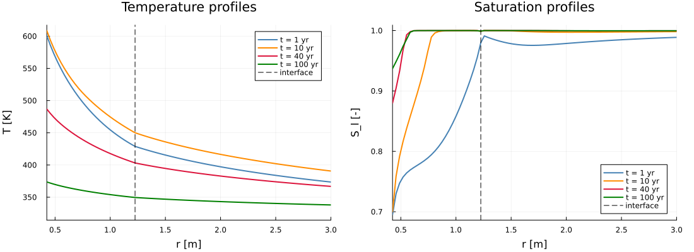

# Regression references

References record numerical behavior; they do not establish physical accuracy.
Regenerate a reference only for an intentional change, and document the reason.

## Where the numbers are asserted

`test/Manifest.toml` is committed, and the Julia 1.12 CI jobs instantiate it with
`allow_reresolve: false`. This is the one environment in which the references are
compared. The reason is measured rather than precautionary: twice in two days a tolerance
set from a CI measurement was invalidated by the very next run, with an unrelated package
as the only difference in the resolved manifest — DispatchDoctor 0.4.28 → 0.4.29 with
DomainSets 0.8.1 → 0.8.2 on the chloride signature, GeometryBasics 0.5.12 → 0.5.13 on the
drying one. A reference compared in an environment that is never twice the same measures
the resolver as much as the package.

The Julia 1 jobs keep resolving from scratch, because that is what catches an unbounded
dependency whose API has moved, but they run every group except `regression`. Tolerances
below still cover what remains once the environment is fixed: the difference between the
macOS ARM machine that generated the references and the x86 runners that read them.

## Non-isothermal drying

The drying reference was renewed after correcting the exponential retention branch.
Previously, `ExponentialCutoff` returned exactly 1 for nonpositive capillary pressure,
but approached `1 - (1 - S_l(p_c3))/exp(1)` from the positive side. This jump also
removed the water storage derivative in the initially nearly saturated rock
(`p_c = -50.10 Pa`). On the axisymmetric case, the first pressure update approached
14.16 MPa as the time step decreased from 0.01 s to 1e-6 s; time-step reduction
could not satisfy the 1e4 Pa update target.

The exponential branch now extends to negative pressures and approaches saturation
asymptotically. The capillary entropy integral uses the same signed pressure interval.
The solver also stops at every change in the imposed heat flux, controls pressure
and temperature changes separately (1e4 Pa and 1 K), and permits a failed Newton
step to be retried. A segment must still reach its requested end time.

The new reference includes the axisymmetric geometry (92 nodes from 0.425 to 10 m,
with the clay/rock interface at 1.225 m), region-specific material storage, dissolved
air, and the time-dependent boundary flux. It replaces the old planar reference
whose temperature remained exactly 323 K at all nodes and all ten output times.
That reference recorded a frozen state despite continuous heating. Additional
checks require evolving temperatures, positive air
pressures, bounded saturations, and a nonzero rock water-storage derivative.

The corrected 100-year run reaches all ten outputs. The canister temperature at
4 years is 615.22 K and at 100 years is 373.68 K. These are numerical results for
the specified model, not a physical validation of its constitutive laws at those
temperatures. The thermal retention factor remains positive at the saved states.

Halving both the update target (`Δu_opt = 0.5`) and maximum time step to half a
year changes the saved profiles by at most 0.00233 K, 6.04 kPa in liquid pressure,
and 1.43 kPa in air pressure on this mesh (Julia 1.12.7, macOS ARM64).

The first CI run with this corrected reference exposed a portability mismatch:
[run 35268241275](https://github.com/MicroPoroChemoMechanics/PoroMechanics.jl/actions/runs/35268241275)
reported the same relative L2 difference, **3.286368518461479e-8**, in all four
Linux/Windows x64 jobs using Julia 1.12.7 and 1.13.0. This was their only failing
assertion; the completed-transient and physical checks passed. The largest absolute
difference was 47.55 Pa (3,737,557.30 Pa in the reference versus 3,737,509.75 Pa in CI),
well below the 6.04 kPa sensitivity measured when refining time steps.

A tolerance of 1e-7 was set from that measurement, a factor of about three over it. It
survived one day. [Run 35315496053](https://github.com/MicroPoroChemoMechanics/PoroMechanics.jl/actions/runs/35315496053)
measured **1.5416159893909087e-7** in three of the four jobs — bit-identical between them —
and below 1e-7 in the fourth, windows-latest with Julia 1.13.0, which passed. The commit
under test changed only the Biot example, the tolerances and this file. The single
difference in the resolved manifest was GeometryBasics 0.5.12 → 0.5.13, a package that
carries no physics for this solve. The same entry then read 3,737,730.56 Pa instead of
3,737,509.75 Pa: the mismatch is not a fixed offset but the accumulated divergence of the
adaptive step sequence, and its size depends on the environment.

The default drying tolerance is therefore **1e-5**, anchored to what the scheme itself
controls rather than to the drift measured on a given day. Halving `Δu_opt` and the
maximum step moves one entry by 6.04 kPa, which is 1.6e-6 in relative L2 against a
reference norm of 3.83e9; any threshold below that asserts more than the discretization
guarantees. 1e-5 keeps a factor of 65 over the observed drift and still catches a real
change by orders of magnitude — correcting `ExponentialCutoff` rewrote this reference
wholesale. The reference, solver, and physical checks are unchanged.
`POROMECHANICS_STRICT_REGRESSION=true` still requests 1e-10. These measurements establish
an environment-dependent difference, not its precise floating-point cause; no separate
tolerance is selected by OS.



```sh
GKSwstype=100 julia +1.12 --project=examples examples/nonisothermal_drying/run.jl
julia +1.12 --project=examples test/regression/generate.jl nonisothermal_drying
julia +1.12 --project -e 'using Pkg; Pkg.test(test_args=["core", "regression"])'
```

## Certified chloride chemistry

The chloride reference was renewed when `run_4.jl` switched its transient Gibbs
equilibria and Friedel sensitivities to ChemistryLab's certified API. Failed
certification now aborts the segment.

The reference's relative L2 tolerance was **1e-6** and is now **1e-3**. Certification
fixed what it was meant to fix — a reference built on unconverged states — but it did not
make the signature portable. Against this Mac-generated reference, CI measures
1.0148565190861922e-4 on ubuntu-latest and 1.0148565194436454e-4 on windows-latest, the
same values in runs two days apart: reproducible per environment, not noise. A later run
of the same code came back under 1e-6, and the only difference in the resolved manifest
was DispatchDoctor 0.4.28 → 0.4.29 with DomainSets 0.8.1 → 0.8.2. Neither package carries
physics; both change specialization, hence the last bits, which the coupling amplifies by
about twelve orders of magnitude. At 1e-6 the test reported which versions the resolver
picked that morning. The new threshold keeps one decade over the measured spread and
should be tightened once that amplification is explained — it is the same open question
as the non-stationary OPC initial equilibrium.

The old interior-point path returned 24 uncertified transient states in the small
regression case. These states conserved elements but failed first-order optimality.
Changing only OptimaSolver from 0.5.1 to 0.5.5 changed the certified initial amounts
by less than 7e-12 mol, yet the unconverged transient solves amplified that difference
into a failed regression. Reusing the exact 0.5.1 initial state under 0.5.5 recovered
the entire old signature bit for bit. Changing BLAS from four threads to one did
not affect the 0.5.1 result on the tested Mac.

Controlled comparisons used Julia 1.12.7, patched ChemistryLab 0.15.2, 12 cells,
two saved profiles over 0.1 year, and identical remaining dependencies:

| Transient chemistry | Relative L2 difference between OptimaSolver 0.5.1 and 0.5.5 | Certified states per run |
| :--- | ---: | ---: |
| Historical interior-point solver | Approximately 1.17e-4 | 0/24 |
| Certified solver | Approximately 5.75e-11 | 24/24 |

At node 8 of the first saved profile, adsorbed calcium changes from approximately
20.311 to 19.483 mol/m³ of medium. This is an intentional consequence of enforcing
equilibrium, not a tolerance adjustment. The comparison below shows both saved
profiles; the two certified dependency versions overlap at this scale.


To reproduce the reference and checks from the repository root:

```sh
julia +1.12 scripts/prepare_chemistrylab.jl
julia +1.12 --project=examples -e 'using Pkg; Pkg.develop(path="."); Pkg.instantiate()'
julia +1.12 --project=examples test/regression/generate.jl chloride_ingress
julia +1.12 --project -e 'using Pkg; Pkg.test(test_args=["regression", "chemistry"])'
```

The initial interior-point *guess* can still emit `MaxIters`; the initialization
adapter certifies the state it actually accepts. The separate legacy-optimizer
test remains an expected failure. Local equilibrium certification does not validate
the accuracy or global conservation of the full SNIA splitting scheme, nor does
this Mac comparison replace Linux/Windows CI checks.
